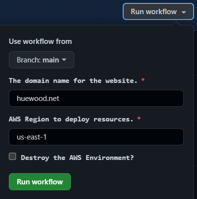

# Jekyll AWS S3

This project is a template to setup a website built using Jekyll, an open-source static website generator Ruby-based framework. 

Jekyll provides both the functionality to generate the required HTML, CSS & JavaScript files as well as a local web server for development purposes. 

This template is designed for hosting on an Amazon Web Services (AWS) S3 Bucket with Static Web Hosting; providing a low cost & high performance solution to static web hosting. 

CI/CD has been implemented to provide automatic code compilations to be deployed to the aforementioned AWS infrastructure.

## Website

### Getting Started

These instructions will get you a copy of the project up and running on your local machine for development and testing purposes. 

See Infrastructure & Deployment sections for instructions on how to deploy the website on a live system.

### Pre-Requisites

Maintaining this codebase will require the following software installed on your local machine:

- Jekyll: Refer to [Jekyll official documentation](https://jekyllrb.com/docs/installation/) for information on how to install.
- Code Editor: [Visual Studio Code](https://code.visualstudio.com/) or [Sublime Text](https://www.sublimetext.com/) are recommended.

### Usage

There are several relevant and useful commands Jekyll offers to assist with local development:
- jekyll serve -w : Launches a local web server with regeneration of files if editted
- jekyll build : Compiles the website code under ./_site
- jekyll clean : Cleans all generated files & cache

For more information, see [Jekyll useful commands](https://jekyllrb.com/docs/usage/) documentation.

## Infrastructure

### Pre-Requisites

Provisioning the AWS resources for this site requires the following steps be followed:
1. Set-up an AWS account & create a Programmic Access Key Pair
2. Purchase the Domain & create Hosted Zone in Route53; noting the Hosted Zone ID
3. Create a S3 bucket for terraform state file to be stored called 'domain-terraform' (ie. testdomain-terraform)
4. Create [GitHub Action secrets](https://docs.github.com/en/actions/security-guides/encrypted-secrets#creating-encrypted-secrets-for-a-repository) for the following values:
    - AWS_ACCESS_KEY
    - AWS_SECRET_KEY
    - ZONE_ID

## Deployment

The deployment of both the website and underlying infrastructure can be completed using GitHub Actions. There are 2 'workflows' which deploy these respectively.

### Infrastructure

The deployment of the AWS infrastructure is a manual, one off process which is required before the website can be deployed.

####Steps:
1. Login to the GitHub Respository
2. Go to 'Actions' tab
3. Click 'Terraform Deployment'
4. Click 'Run workflow' & provide the required variables:
    - Use workflow from 'Branch: main'
    - Domain name: the root domain name of the website you are looking to host (ie testdomain.net)
    - AWS Region: the AWS region to deploy resources to (ie. us-east-1)
    - Destroy: Set to true if you wish to destroy the environment

    

### Website

The deployment of the website is automatically triggered based on commit actions to the 'main' branch. 

This workflow will build the Jekyll website & deploy the generated files to the S3 Bucket (previously deployed with the Terraform workflow) to be used as a static-website.

## Authors

- [huewood](https://github.com/huewood)